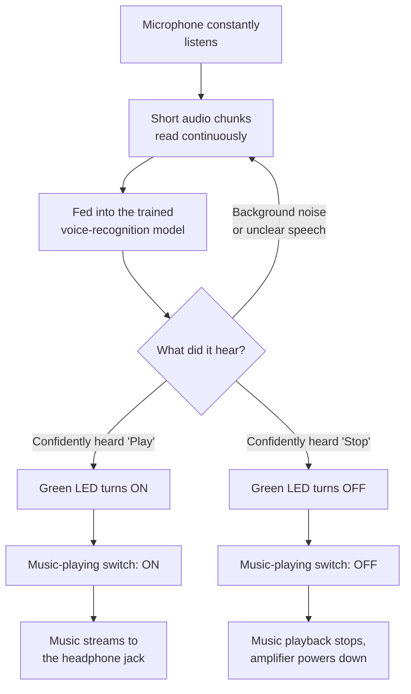
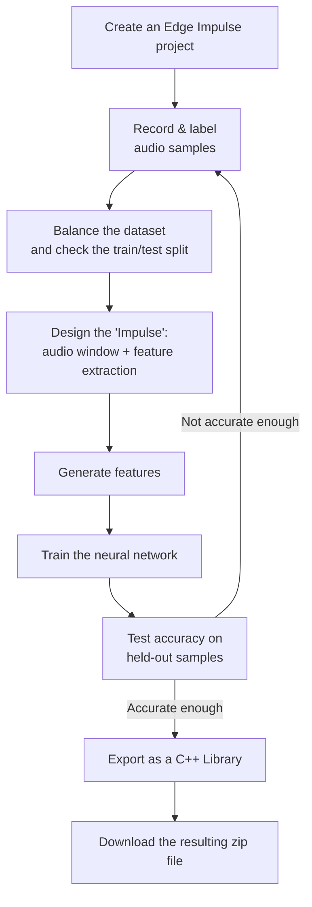

# ML_voice — Voice-Controlled Music Playback (ESP32 LyraT-Mini v1.2)

Say **"Play"** → music starts through the headphone jack and a green LED lights up.
Say **"Stop"** → the music stops and the LED turns off.

Fully on-device voice command recognition — no WiFi, no cloud, no phone app. A custom
[Edge Impulse](https://edgeimpulse.com) keyword-spotting model listens continuously
through the board's own microphone and classifies short audio windows into `Play`,
`Stop`, `Noise`, or `Unknown`.

## Hardware

- ESP32 LyraT-Mini v1.2 (built-in ES7243E mic codec, ES8311 speaker codec)
- Headphones/earphones (headphone jack output)

## Project layout

```
ML_voice/
├── main/                     ESP-IDF application: mic capture, classifier bridge,
│                             speaker/LED trigger logic
├── components/edge_impulse/  Exported Edge Impulse C++ inferencing SDK, wrapped as
│                             an ESP-IDF component
├── tools/                    Serial capture/diagnostic helper scripts
├── partitions.csv            Flash partition table
└── sdkconfig.defaults        Base ESP-IDF project configuration
```

## Building and flashing

Requires ESP-IDF v6.0.2 with the toolchain on `PATH`. From the project root:

```powershell
idf.py -p COM3 build flash monitor
```

## Status

Core pipeline (mic → classifier → LED/music trigger → speaker) is working end to end.
Current focus is improving Play/Stop classification accuracy — see the
[troubleshooting section](#13-troubleshooting--problems-this-project-actually-hit) below
for details and the recommended fix (retraining with samples captured through the
board's own microphone).

---

# Full build guide

### A complete build guide for the ESP32 LyraT-Mini v1.2

> Say **"Play"** → music starts through the headphone jack and a green LED lights up.
> Say **"Stop"** → the music stops and the LED turns off.

---

## Table of Contents

1. [What you're building](#1-what-youre-building)
2. [What you'll need](#2-what-youll-need)
3. [Key concepts explained](#3-key-concepts-explained)
4. [The hardware](#4-the-hardware)
5. [How the whole system fits together](#5-how-the-whole-system-fits-together)
6. [Part A — Training the voice recognition model](#6-part-a--training-the-voice-recognition-model)
7. [Part B — Turning the trained model into firmware code](#7-part-b--turning-the-trained-model-into-firmware-code)
8. [Part C — Listening for the voice commands](#8-part-c--listening-for-the-voice-commands)
9. [Part D — Playing music and lighting the LED](#9-part-d--playing-music-and-lighting-the-led)
10. [Part E — Connecting detection to action](#10-part-e--connecting-detection-to-action)
11. [Building and flashing the firmware](#11-building-and-flashing-the-firmware)
12. [Tuning it after your first successful test](#12-tuning-it-after-your-first-successful-test)
13. [Troubleshooting — problems this project actually hit](#13-troubleshooting--problems-this-project-actually-hit)
14. [Glossary](#14-glossary)

---

## 1. What you're building

A small embedded device that listens continuously through a microphone, recognizes two
spoken commands — "Play" and "Stop" — and reacts by playing a short piece of music
through a headphone jack and lighting an LED, entirely on its own, with no internet
connection, no phone app, and no cloud service involved. Everything — listening,
recognizing speech, and playing audio — happens on a single small microcontroller board.

This is called **on-device voice control**, and the specific technique used to recognize
the two words is called **keyword spotting** — a lightweight form of speech recognition
that only needs to distinguish a small, fixed set of words (as opposed to full speech-to-
text, which understands *any* words and needs far more computing power than this board
has).

---

## 2. What you'll need

### Hardware
| Item | Notes |
|---|---|
| ESP32 LyraT-Mini v1.2 development board | Has a built-in microphone and headphone output already wired to the ESP32 chip |
| USB cable | To connect the board to your computer for programming |
| Headphones or earphones | Plugged into the board's headphone jack to hear the music |
| A computer (Windows, in this guide) | To write, build, and upload the firmware |

### Software / accounts
| Item | Purpose |
|---|---|
| A free [Edge Impulse](https://edgeimpulse.com) account | Where you'll train the voice-recognition model |
| ESP-IDF (Espressif IoT Development Framework) | The official toolchain for writing ESP32 firmware in C |
| A code editor | For editing the firmware source files |

You do **not** need any prior experience with machine learning, digital signal
processing, or C/C++ — each piece is explained as it comes up.

---

## 3. Key concepts explained

Before diving in, here are the handful of ideas this whole project rests on:

- **Firmware** — the program that runs directly on the microcontroller (as opposed to
  an app on your phone or a program on your PC). Written in C in this project.
- **ESP-IDF** — Espressif's official software framework for writing ESP32 firmware.
  It provides ready-made building blocks for things like reading from a microphone,
  writing to a speaker, and managing multiple tasks running at once.
- **Microphone codec / Speaker codec** — small dedicated chips on the board that
  convert real-world sound into digital data (microphone codec) and digital data back
  into real-world sound (speaker codec). The main ESP32 chip talks to these over a
  couple of standard digital audio and control connections rather than handling raw
  analog audio itself.
- **Machine learning model** — in this project, a small neural network trained to look
  at a short clip of audio and decide which of four categories it belongs to: the word
  "Play," the word "Stop," background noise, or some other unrecognized sound.
  "Training" the model means showing it many example recordings of each category until
  it learns to tell them apart.
  "Confidence" is how sure the model is about its answer.
- **Edge Impulse** — a web platform used to record example audio, train the model, test
  its accuracy, and export the finished model as ready-to-use code — without needing to
  write any machine learning code by hand.
- **Task** — in embedded firmware, a task is a small independent program that runs
  concurrently with other tasks on the same chip. This project uses one task that
  constantly listens to the microphone and classifies audio, and a separate task that
  handles playing music, running side by side.

---

## 4. The hardware

The ESP32 LyraT-Mini v1.2 board has a audio chips already wired to it:

| Function | Chip on the board | How the ESP32 talks to it |
|---|---|---|
| Microphone input | ES7243E | A dedicated digital audio connection, plus a shared control connection |
| Speaker / headphone output | ES8311 | A second, separate digital audio connection, plus the same shared control connection |
| Amplifier switch | — | A single on/off signal that powers the headphone amplifier only while music is playing |
| Status LEDs | — | Two simple on/off signals — this project uses the green one |

Both audio chips share one control connection (used to configure settings like volume
and gain) and, importantly, share a single clock signal that keeps their digital audio
in sync. Only one of the two chips is allowed to *generate* that clock signal — the
microphone chip generates it, and the speaker chip is set up to just use it rather than
trying to generate its own, which would conflict.

> You don't need to rewire anything — all of this is already connected on the board.
> It's described here so the firmware configuration later on makes sense.

---

## 5. How the whole system fits together



The project is built in five parts, each covered in its own section below:

- **Part A** — train the voice-recognition model using Edge Impulse (no coding).
- **Part B** — take the trained model and wire it into the firmware project.
- **Part C** — write the firmware code that continuously listens and classifies audio.
- **Part D** — write the firmware code that plays music and controls the LED.
- **Part E** — connect the two: when a command is recognized, trigger the LED and music.

---

## 6. Part A — Training the voice recognition model

> **Why this comes first:** the model has to exist before the firmware can use it. This
> entire part happens in your web browser, not on the device.

Espressif's own built-in wake-word recognizer was tried first for this project and
never worked reliably on this board, so a custom model — trained specifically on the
words "Play" and "Stop" — is used instead.



### Step A1 — Create the project
1. Sign in to Edge Impulse Studio and create a new project.
2. Give it a clear, unambiguous name. (This project once ended up with two
   similarly-named projects by accident, which caused real confusion later — worth
   avoiding from the start.)

### Step A2 — Record and label samples
You need example audio recordings for four categories:

| Category | What to record |
|---|---|
| **Play** | You saying the word "play," clearly, roughly one second per clip |
| **Stop** | You saying the word "stop," the same way |
| **Noise** | Silence, or typical background noise from wherever the device will actually sit |
| **Unknown** | Any other speech or sound that is neither command word |

You can record samples directly in the browser (Edge Impulse can use your computer's or
phone's microphone), or upload existing audio files. Recording through a microphone as
close as possible to the one on your actual device — rather than, say, a laptop's
built-in mic — will give you noticeably better real-world accuracy, since a model
trained on one microphone's characteristics doesn't always generalize perfectly to a
different microphone.

Aim for at least 80-100 samples per category to start.

> **A pitfall to avoid:** if you record many short clips through a tool that names files
> automatically in sequence (like a sound recorder producing `Play (1).wav`,
> `Play (2).wav`, and so on) and then bulk-upload them with "label from filename"
> turned on, Edge Impulse may end up creating a separate category per filename instead
> of grouping them under one shared label. If you notice dozens of near-duplicate
> categories appear, go back and edit each sample's *label* field (not its filename)
> back to the correct shared category.

### Step A3 — Balance your dataset
Open the class summary and make sure no category has drastically fewer samples than the
others. Edge Impulse automatically splits your samples into a training set and a
smaller testing set (roughly 80/20) — if it warns that this split has become uneven
after adding more data to one category, use the rebalance option it offers.

### Step A4 — Design the "Impulse"
An "Impulse" is Edge Impulse's term for the full processing pipeline: how a raw audio
clip gets turned into something a neural network can learn from.

1. Set the audio window to 1 second, re-evaluated roughly every 250 milliseconds. This
   controls both how much audio the model considers at once, and — once deployed — how
   often it re-checks live audio for a new word.
2. Add an **MFCC** processing block. MFCC stands for *Mel-Frequency Cepstral
   Coefficients* — a standard way of converting raw audio into a representation that
   emphasizes the frequency patterns human speech naturally has, which is far easier
   for a small neural network to learn from than raw audio samples directly.
3. Add a **Classification (Neural Network)** learning block — this is the part that
   actually learns to tell the categories apart.

### Step A5 — Generate features
Open the MFCC block and click "Generate features." This runs your recorded audio
through the MFCC processing step for every sample, so the neural network has something
to train on. If Edge Impulse reports a configuration problem here, it usually suggests
an adjustment (such as reducing the number of filters) directly in its error message.

Afterwards, check the feature explorer visualization — ideally, samples from different
categories should form visually distinct clusters. Heavy overlap between two categories
here is an early warning that those two categories may end up being confused later.

### Step A6 — Train the model
Open the neural network training page, leave the default architecture for a first
attempt, and start training. Watch the accuracy graph to confirm it's improving and
settling rather than staying flat or wildly unstable.

### Step A7 — Test the model
Open "Model testing" and run your held-out test samples through the trained model.
Review the resulting confusion matrix — a table showing, for each true category, what
the model actually predicted. If one category is consistently weak, the most effective
fix is usually recording more (and cleaner) samples for that specific category and
retraining, rather than only adjusting the model's architecture.

### Step A8 — Export as a C++ Library
1. Open the Deployment tab and choose **C++ Library** as the target.
2. Choose an optimization option: a smaller, faster **quantized (int8)** model, or a
   simpler **unoptimized (float32)** model — a good choice if you just want to get
   everything working for the first time before optimizing.
3. Click Build. Edge Impulse packages your trained model together with its recognition
   engine and gives you a zip file to download.

This zip file is what Part B turns into firmware.

---

## 7. Part B — Turning the trained model into firmware code

The zip file from Edge Impulse contains a general-purpose C++ recognition engine — it
isn't yet set up to build inside an ESP-IDF project. This part wires it in.

### Step B1 — Add it to the project
Extract the zip's contents into a new folder inside the firmware project dedicated to
holding the Edge Impulse code. This folder ends up containing the recognition engine
itself, the trained model's parameters, and the compiled neural network.

### Step B2 — Write a build configuration for it
The zip includes its own build instructions, but they target a different build system
than ESP-IDF uses, so a replacement build configuration needs to be written for this
folder. It needs to:

- Include the recognition engine, audio-processing, and neural-network-execution source
  files from the extracted folder.
- **Deliberately exclude** a set of hardware-accelerated files meant only for more
  powerful ESP32 variants (S3/P4) — those files won't work on a plain ESP32 and aren't
  needed; the ordinary, portable versions of the same functionality are used instead.
- Include one specific portable math library component that a header file in the engine
  always expects to be available on Espressif chips.
- Loosen a couple of compiler warning settings that the recognition engine's own code
  triggers, so the overall project's stricter warning settings don't block the build.

### Step B3 — Bridge C++ and C
The Edge Impulse engine is written in C++ and uses some C++-only language features.
The rest of this project's firmware is written in plain C. To let the two work
together cleanly, a small "bridge" is added:

- A plain-C-compatible interface with three operations: initialize the recognizer, ask
  how much audio it wants per check, and feed it a chunk of audio (which returns
  whichever category it recognized, plus how confident it was).
- Behind that interface, a C++ source file does the real work: it collects incoming
  audio into a buffer until it has a full window's worth, then asks the recognition
  engine to classify it, and reports back the top-scoring category.
- Audio samples are handed to the engine exactly as raw numbers, matching precisely how
  Edge Impulse Studio itself read your uploaded WAV files during training — this
  consistency matters, since even small mismatches between training and deployment data
  formatting can hurt accuracy.

### Step B4 — Register everything in the build
Finally, the new bridge file and the Edge Impulse folder are added as build
dependencies of the firmware's main application code, so everything compiles together
into one program.

---

## 8. Part C — Listening for the voice commands

This part covers the firmware code responsible for capturing live audio from the
microphone and continuously feeding it to the recognizer built in Part B.

### Step C1 — Start the microphone's digital audio connection
Configure the ESP32's audio input hardware to receive a continuous stream of digital
audio from the microphone chip, providing the shared clock signal that chip needs to
operate.

### Step C2 — Configure the microphone chip itself
Over the shared control connection, configure the microphone chip's settings — most
importantly its **input gain**, which controls how sensitive it is to quiet sounds.
This should be done using the proper, dedicated driver for that exact chip model rather
than manually sending raw configuration commands by hand — an earlier version of this
project did the latter, and it turned out to be subtly wrong in a way that made the
microphone appear completely non-functional for a long time, despite the hardware being
perfectly fine. Using the correct driver avoids that entire class of mistake.

### Step C3 — Continuously read and classify audio
In an ongoing loop:
1. Read a small chunk of fresh audio from the microphone.
2. Extract just the channel that carries real audio (on this specific board, only one
   of the two stereo channels actually carries a usable signal — the other reads as
   unusable/floating regardless of what's happening acoustically).
3. Hand that chunk to the recognizer bridge from Part B.
4. Whenever the recognizer reports it has finished evaluating a full window of audio, it
   returns which category it thinks it heard and how confident it is — this result
   feeds directly into Part E.

---

## 9. Part D — Playing music and lighting the LED

### Step D1 — Start the speaker's digital audio connection
Configure the ESP32's audio output hardware to send a continuous stream of digital audio
to the speaker chip. Unlike the microphone side, this connection generates its own
internal clock rather than sharing the microphone's, avoiding the two-chips-fighting-
over-one-clock problem mentioned in §4.

### Step D2 — Configure the speaker chip itself
Over the shared control connection, configure the speaker chip's settings. Two details
matter a great deal here:
- The speaker chip must be told that the *ESP32* is in charge of timing (the "master"),
  and that it should simply follow along (the "slave") — getting this backwards was the
  actual root cause of the speaker producing complete silence for a long stretch of this
  project, even though every other part of the audio pipeline was working correctly.
- The chip needs explicit reference voltage values for its internal amplifier and
  digital-to-analog converter; leaving these unset can silently result in an almost
  inaudible output level even though everything otherwise "works."
- Hand control of the amplifier's on/off switch directly to this driver, so it can
  automatically power the amplifier only while actually playing sound.

### Step D3 — Prepare the music
Rather than embedding an actual music file (which would require an audio decoder the
small microcontroller doesn't have room for), the "music" in this project is a short
melody generated ahead of time as plain numbers — one sine wave tone per musical note,
each with a brief fade-in and fade-out to avoid audible clicking between notes — and
saved directly into the firmware as a fixed list of numbers. At playback time, the
firmware just streams that list of numbers straight out to the speaker chip; there's no
decoding step involved at all.

### Step D4 — Run playback as its own ongoing task
Set up a task that runs continuously, independent of the listening task from Part C:
- While a "music playing" switch is off, it does nothing and waits.
- The instant that switch turns on, it powers up the amplifier and starts streaming the
  prepared melody out to the speaker chip in small pieces, looping back to the
  beginning if the switch is still on once the melody finishes.
- The instant the switch turns off, it stops streaming and powers the amplifier back
  down, so the device stays silent (and doesn't inject amplifier noise near the
  microphone) whenever it's not actively playing.

### Step D5 — Wire up the LED
Set up the green LED's pin as a simple digital output, starting in the "off" state.
Nothing more is needed here yet — actually turning it on and off happens in Part E,
right at the moment a command is recognized.

---

## 10. Part E — Connecting detection to action

This is the part that ties everything together: turning a recognized word into a real
action.

Each time the listening loop from Part C receives a classification result, it checks:

- **Was the result "Play," with confidence above your chosen threshold, and is music
  not already playing?** If so: turn the green LED on immediately, and flip the
  "music playing" switch on. The playback task from Part D picks this up on its own and
  starts streaming music — no further coordination is needed.
- **Was the result "Stop," with confidence above your chosen threshold, and is music
  currently playing?** If so: turn the green LED off immediately, and flip the
  "music playing" switch off. The playback task notices this on its own and stops.
- **Anything else** (background noise, an unrecognized sound, or a Play/Stop guess the
  model wasn't confident enough about) is simply ignored, and listening continues.

The **confidence threshold** is the key tuning value here: set it too low, and
background noise will occasionally get misread as a command, causing music to start or
stop on its own; set it too high, and genuine spoken commands may get ignored because
the model wasn't quite confident enough. Expect to adjust this value based on real-world
testing — see §12.

---

## 11. Building and flashing the firmware

Once every part above is in place:

1. Set up your ESP-IDF environment variables so the build tools (compiler, CMake,
   Ninja, and the ESP-IDF Python environment) are all on your system's search path.
2. Run the ESP-IDF build tool's `build` action from the project's root folder — this
   compiles the entire firmware, including the Edge Impulse recognition engine, the
   listening loop, and the playback logic, into a single program image.
3. With the board connected over USB, run the build tool's `flash` action targeting the
   correct serial port — this uploads the compiled program onto the board's flash
   memory.
4. Optionally, run the build tool's `monitor` action (or a separate serial terminal) to
   watch the board's live log output, which is invaluable for confirming detection and
   playback are actually happening as expected.

---

## 12. Tuning it after your first successful test

Getting a first successful build and flash is a milestone, not the finish line — a
freshly trained model rarely behaves perfectly on the very first try. Expect to iterate
on:

| Symptom | Likely adjustment |
|---|---|
| Music starts/stops on its own with no one speaking | Raise the confidence threshold |
| Genuine "Play"/"Stop" commands aren't being recognized | Lower the confidence threshold, or check actual confidence values via the log output to see how close you are |
| The model consistently confuses "Play" and "Stop" | Not a threshold problem — record more real samples of both words through the board's own microphone and retrain the model in Edge Impulse |
| Detection feels laggy, several seconds behind speech | Check for excessive log output slowing down the listening loop — keep live logging to meaningful events only, not every audio chunk |
| Playback is too quiet or too loud | Adjust the speaker chip's output volume setting |

---

## 13. Troubleshooting — problems this project actually hit

These were real dead ends encountered while building this exact project, kept here so
you can recognize them faster if you hit the same symptoms:

- **Built-in wake-word engine never worked** — abandoned in favor of the custom Edge
  Impulse model described in Part A; not every board/framework combination supports
  every built-in feature equally well.
- **Microphone appeared completely dead** — real audio signal level stayed flat no
  matter how loudly or clearly commands were spoken, across many tests. The eventual
  cause was a hand-written, raw configuration sequence for the microphone chip with a
  subtly incorrect audio format setting — not a hardware fault. Switching to the proper
  dedicated driver for that chip fixed it immediately (Step C2).
- **Speaker appeared completely dead too** — same category of mistake on the other
  audio chip: it was configured as the timing master when it should have been the
  slave, and its analog gain reference values were left unset (Step D2). Both were
  silent failures — no error was reported, the chip just produced no audible sound.
- **The model confuses "Play" and "Stop"** — confirmed to not be a code bug (the
  category ordering in the firmware exactly matches the model's own metadata). The
  real cause was that the model had mostly been trained on recordings from a laptop
  microphone rather than the board's own microphone, so it didn't generalize perfectly
  to the real deployment audio. Retraining with fresh samples recorded through the
  board's own (working) microphone is the correct fix.
- **Detection lagged by several seconds** — caused by excessive diagnostic logging sent
  over the serial connection during hardware debugging, which was slow enough to make
  the listening loop fall behind live audio. Reducing logging to only meaningful events
  (a command actually recognized) rather than every single audio chunk resolved it.

---

## 14. Glossary

| Term | Meaning |
|---|---|
| **ESP32** | The microcontroller chip at the heart of this board — runs the firmware |
| **ESP-IDF** | Espressif's official software framework for programming the ESP32 in C |
| **Firmware** | The program that runs directly on the microcontroller |
| **Codec** | A chip that converts real-world audio to digital data, or digital data back to audio |
| **I2S** | A standard digital audio connection type used between the ESP32 and the audio codec chips |
| **I2C** | A standard low-speed control connection, used here to configure the codec chips' settings |
| **MFCC** | Mel-Frequency Cepstral Coefficients — a way of converting raw audio into a form that emphasizes speech-relevant frequency patterns |
| **Neural network** | A type of machine learning model, trained on examples, used here to classify short audio clips |
| **Confidence** | A 0–1 score representing how certain the model is about its classification |
| **Keyword spotting** | Recognizing a small, fixed set of specific words, as opposed to general speech-to-text |
| **Task** | An independently running piece of firmware that executes concurrently with other tasks |
| **Quantized model** | A model whose internal numbers have been shrunk to a more compact format, trading a small amount of accuracy for reduced size and faster execution |
